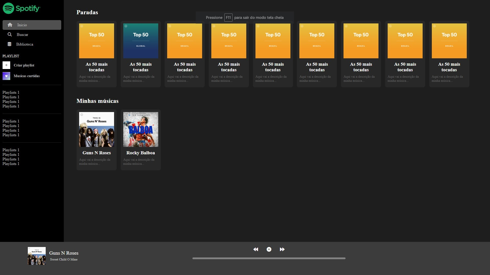

  

Front-end clone do Spotify, repassado no curso da Danki Code Front-end completo.

  <a href="#-tecnologias">Tecnologias</a>&nbsp;&nbsp;&nbsp;|&nbsp;&nbsp;&nbsp;
  <a href="#-projeto">Projeto</a>&nbsp;&nbsp;&nbsp;|&nbsp;&nbsp;&nbsp;
  <a href="#-preview">Preview</a>

 

## 🚀 Tecnologias
Esse projeto foi desenvolvido com as seguintes tecnologias:
- [HTML5](https://html.com/)
- [CSS3](https://developer.mozilla.org/pt-BR/docs/Web/CSS)
- [Javascript](https://www.javascript.com)

 
 

## 📖 Projeto
Clone do front-end do spotify, desenvolvido com HTML5, CSS3 e JS no curso Danki Code front-end completo. Focado em praticar sobre <b>flexbox para responsividade e manipulação do player de audio</b>.
 
 

## 🖥 Preview

  

Veja o projeto funcionando <a href="https://kevynfirst.github.io/spotify-clone/">aqui</a>. 👈
 

## 😉 Obrigado por visitar meu projeto

Você pode conferir outros projetos que desenvolvi aqui no meu GitHub, ou entrar em contato comigo pelos demais links.

